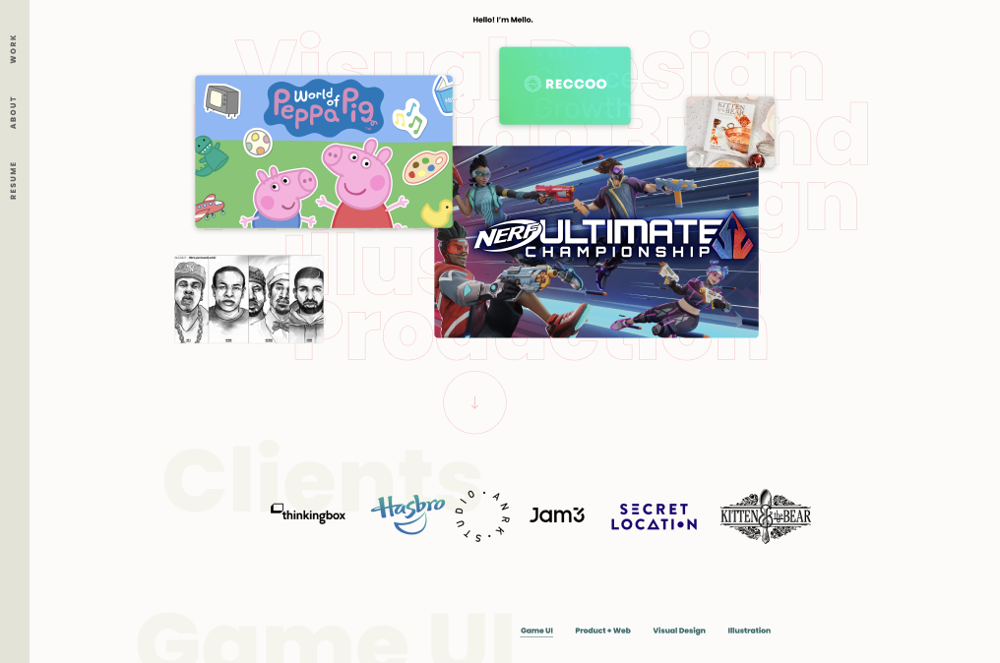

## Mel's Portfolio
**Design**: [Figma link](https://mel-portfolio-six.vercel.app/)


## Getting Started

First, run the development server:

```bash
npm i # install dependencies
npm run dev # run server
```

Open [http://localhost:3000](http://localhost:3000) with your browser. Models will be created on [http://localhost:9999](http://localhost:9999). You can fill out the content using [the corresponding Prismic repository](https://mel-portfolio.prismic.io).
